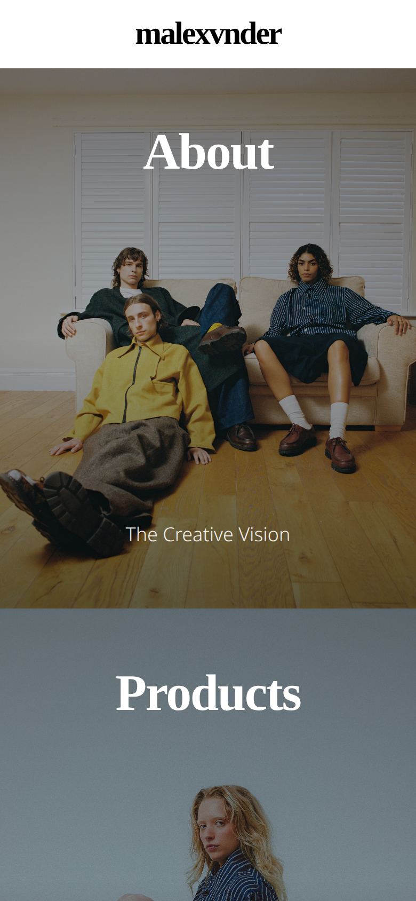

= malexvnder

This is a fashion portfolio for Max Grimshaw, Manchester.

The codebase is a React webapp, preconfigured with Typescript, Vite and ESLint.

== Running the App

Install https://nodejs.org/en/download[Node.js] and run the following commands:
[source, bash]
----
npm install
npm run dev
----

This will start the development server and provide a link to access the app in your browser, typically at `http://localhost:5173`.

== Building the App

To build the app for production, run:
[source, bash]
----
npm run build
----

This will create a `dist` directory with the production build of the app.
The build can be previewed with:

[source, bash]
----
npm run preview
----
